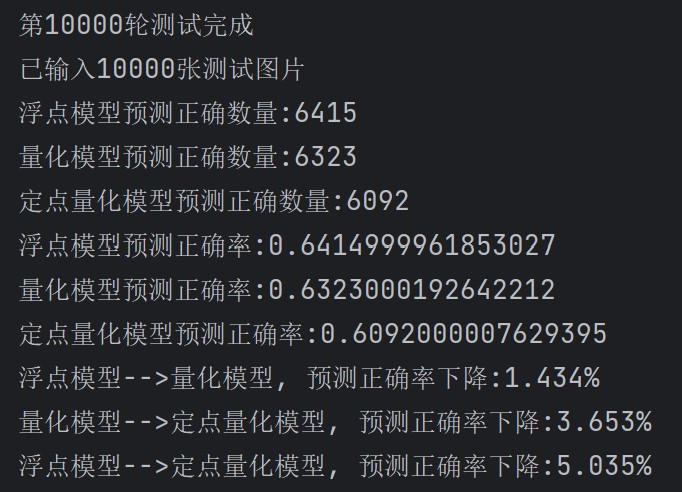

### 概述

本工程使用Pytorch库完成简单的神经网络的**构建、训练、训练后静态量化（post training static quantization）、量化模型参数导出、定点数计算模拟**，实现了将训练后的模型导出为hex格式保存的txt/coe文件， 以便后续通过testbench读取文件数据在FPGA/ASIC上进行神经网络计算功能仿真。本工程的重点在于参数的量化和导出，原始浮点模型并没有训练得很好，图1是总的结果概览。



<center>图1. 结果概览</center>

**注意：本工程所定义的function涉及到许多对字典的操作，通过字典字符串key来得到相应的量化参数。因此，为了不引入不必要的麻烦，相关字典key在更改时需要多加留心。**

由于很久没有用Python了，先前亦无Pytorch库的基础，算是边学边上手，故本工程预计存在许多可以改进的地方，若有任何问题，欢迎各位通过lauchinyuan@yeah.net联系我，能与各位共进步是做开源的一个重要动力。

### 如何使用

工程目录[env_requirements](./env_requirements)提供了构建本工程时的环境配置信息，有两个版本，使用方式如下，二选一即可，当然也可以使用已有环境手动安装各种packages。

```tcl
# 方式1：通过conda依据environment.yml新建虚拟环境(工程实际采用)
conda env create -f environment.yml
# 方式2：新建一个虚拟环境， 接着通过需求文件pip安装库
pip install -r requirements.txt
```

接着clone本工程代码， 运行即可，各文件功能概述如下，若您想研究此工程的内部计算过程， 推荐按以下顺序阅读代码:

#### 主要代码

[model.py](model.py)定义了网络结构。

[main.py](main.py)调用其它基本模块， 实现模型训练、量化、参数导出、测试图片量化这一顺序处理过程。

[train.py](train.py)定义了训练函数的运算过程。

[nn_static_quant.py](nn_static_quant.py)定义了将float模型转换为int8模型的过程，采用训练后静态量化方案。

[nn_quant_export.py](nn_quant_export.py)定义了量化后模型参数(weights、bias)导出的处理过程。对于量化相关的参数（scale和zero_point）， 则保存为字典形式。

[img_quant_export.py](img_quant_export.py)定义了img_quant_export()方法，将输入图片像素量化为uint8类型，并保存到txt以及coe文件中，供硬件使用。这相当于在计算机上提前完成了浮点输入数据的量化工作，量化过程需要用到量化模型scale参数字典(scale_dict)和zero_point参数字典， 该字典内保存有量化模型第一层(quant)的zero_point和scale。

#### 定点计算参考代码

以上代码已经实现了模型的训练、量化、各种定点参数导出。可以直接用Verilog等HDL编写testbench，读取参数、并在所设计的电路结构上进行运算了。

为了进一步确定所设计电路计算结果是否正确，需要计算机程序计算出相关的中间数据进行参考，这个过程MATLAB和Python都可以实现，为了保持一致，本工程通过编写Python计算程序模拟量化数据经过神经网络的各层中间结果，以作为FPGA/ASIC计算的参考。

[nn_forward_verilog.py](nn_forward_verilog.py)相当于模拟定点计算的main程序，运行此文件，可得定点量化模型的各层结果、整个测试集上三种模型(浮点模型、Pytorch量化模型、定点量化模型)的预测表现。为了更加贴近FPGA/ASIC的实际计算，进行参考计算时，activation、weights和bias都从文件读取，与将要设计的FPGA/ASIC电路保持一致。

[nn_quant_basic.py](nn_quant_basic.py)定义了量化后神经网络中的量化计算算子、例如量化的卷积、池化、量化的线性层、此外，此文件还包含各种文件读取函数，例如从txt文件读取bias、image、weights等。这一文件主要被上述[nn_forward_verilog.py](nn_forward_verilog.py)调用，作为其子功能模块。

### 附：静态量化基本原理

量化就是将一个大范围的数按照一定关系映射到一个小范围数的过程，在本工程中专指将float32类型的数映射到8bit数中。

若令 $r$为真实的浮点数， $Q$为量化后的数据， 则两者的映射关系如式(1)、式(2)，其中(1)式为反量化， (2)式为量化， $s$为比例因子(scale)， $Z$为量化后的零点(zero_point)。式中大写字母为整型、小写字母为浮点型。

$$r=s(Q-Z) \tag{1}$$

$$Q=round(\frac{r}{s} +Z) \tag{2}$$

综上，只要有了比例因子(scale)以及零点(zero_point)就能进行量化、反量化过程。Pytorch模型量化过程可以简单理解为自动找到这两个值，然后按公式计算得到量化后的数据 $Q$的过程。 

其实这两个值的计算公式也很简单，如(3)、(4)式，其中下标分别代表最大最小值，但其实可以不关心，因为Pytorch量化框架会帮我们自动计算得到。

$$s=\frac{r_{max}-r_{min}}{Q_{max}-Q_{min}}\tag{3}$$

$$Z=round(Q_{max}- \frac{r_{max}}{s})\tag{4}$$

#### Pytorch具体如何进行量化？

Pytorch模型量化方案有三种，按照何时进行量化可分为：

1. 训练时量化(量化感知训练，QAT)：在模型训练时就引入量化的影响，来提高量化模型准确性。
2. **训练后量化**，其中又可以分为
   1. **静态量化**：模型量化后，每一层(卷积、池化、线性等)的量化参数(scale、zero_point)都是固定的，在进行参考的过程中不再改变，这种方案适合硬件固定化部署，本工程使用这一方案。
   2. 动态量化：模型在参考过程中依据不同的数据分布(如最大值、最小值等)动态改变量化参数(scale、zero_point)，这样做可以提高量化精度，但计算量也变大，且这种变化导致其不太适合硬件固定部署。

**在Pytorch静态量化的基本过程如下：**

1. 搭建浮点网络模型。
2. 输入训练数据集、训练浮点网络模型，训练完成后，各层网络参数(weights、bias等)固定下来，此时网络参数都是float32类型的，因此网络中的各种计算也都是以浮点数进行。
3. 在网络的输入端插入量化节点`QuantStub`，这一节点在**完成量化后**将float32的输入转换为uint8类型的输入，在网络输出端插入反量化节点`DeQuantStub`，作用与量化节点相反。
4. 通过“prepare”操作，在原网络中自动插入观察器(observer)，这些观察器的作用是观察数据分布，并找到各层输出activation相应的scale和zero_point。
5. 喂具有代表性的数据，在4中插入的观察器开始真正“观察”。
6. 模型转换，依据观察结果得到的相应量化参数， 将浮点模型转换为int8模型。

#### 定点计算如何进行？

完成以上操作后，一个浮点模型就变成了int8模型，每一层输出的数据都是8bit量化数据，每层量化数据都有其独特的scale和zero_point。同样地，各层运算OP需要的权重、bias也均是8bit数据，都有其独特的scale和zero_point。

**但需留意的是，经过Pytorch量化后的bias仍然是float32类型，后面有对其进行处理的方法。**

例如，对于神经网络的卷积层，其运算需要的数据有： 

1. 输入`in`，为量化的8bit数，有量化参数`in_zero`、`in_scale`，分别记为 $Z_1$、 $s_1$。
2. 权重`weight`，为量化的8bit数，有量化参数`weight_zero`、`weight_scale`， 分别记为 $Z_2$、 $s_2$。
3. 输出`out`，为量化的8bit数，有量化参数`out_zero`、`out_scale`， 分别记为 $Z_3$、 $s_3$。

卷积计算，是一系列乘加运算，原始浮点数的卷积计算为(5)式。

$$r_3 = \sum r_1\cdot r_2 +b \tag{5}$$

对 $r_1$、 $r_2$和 $r_3$先进行(1)式的变换，有(6)式：这里暂时还没有对 $b$进行处理，因为其还是float32型。

$$s_3(Q_3-Z_3) = s_2s_1\sum (Q_1-Z_1)\cdot (Q_2-Z_2) +b \tag{6}$$

(6)等式两边同时除以 $s1s2$，有(7)式：

$$\frac{s_3}{s_2s_1}(Q_3-Z_3) = \sum (Q_1-Z_1)\cdot (Q_2-Z_2) +\frac{b}{s_2s_1} \tag{7}$$

观察(7)式最右侧的 $\frac{b}{s_2s_1}$，其与量化过程(2)式相似度很高，相当于对浮点数 $b$以 $scale=s_1s_2$， $zero\\_point = 0$的方式进行量化，因此  $\frac{b}{s_2s_1}$亦可看成定点数记为 $Q_b$，但此举会引入一定精度损失。

由此，最终量化输出结果 $Q_3$的表达式成为(8)式：

$$Q_3 =\frac{s_2s_1}{s_3}[\sum (Q_1-Z_1)\cdot (Q_2-Z_2)+Q_b]+Z_3\tag{8}$$

其中 $\sum (Q_1-Z_1)\cdot (Q_2-Z_2)+Q_b$实际上就是全量化运算的卷积，整个式子只有 $\frac{s_2s_1}{s_3}$还是浮点数， 记为 $M$。参数内容中，均是scale值，这一值在静态量化后是固定的，因此每一层OP的 $M$是一个固定的浮点小数。

将这一个浮点数进行定点化，相关资料表明， $M < 1$，可以使用`n`比特定点数 $M_0$来表示， 把`n`比特数都当成小数位即可。浮点数转定点数的方法是直接将原浮点数乘以 $2^n$，保留整数即可，在硬件计算时将`n`位数当成小数位，截断即可得到整数结果，**此举也会带来一定误差**。至此， (8)式变为(9)式，所有计算都是定点数计算。

$$Q_3 =M_0[\sum (Q_1-Z_1)\cdot (Q_2-Z_2)+Q_b]+Z_3\tag{9}$$

**由分析，本工程一共有三类模型：**

1. 浮点模型
2. 量化模型：Pytorch量化生成的在计算机上运行的模型
3. 定点量化模型：硬件部署时用到的模型，引入了 $M_0$以及 $Z_3$这两个误差来源

可以预见的是，三类模型的精度依此递减。

### 相关参考

1. [Quantization for Neural Networks](https://leimao.github.io/article/Neural-Networks-Quantization/)
2. [Pytorch doc: Introduction to Quantization](https://pytorch.org/docs/stable/quantization.html)

3. [PyTorch Static Quantization](https://leimao.github.io/blog/PyTorch-Static-Quantization/)
